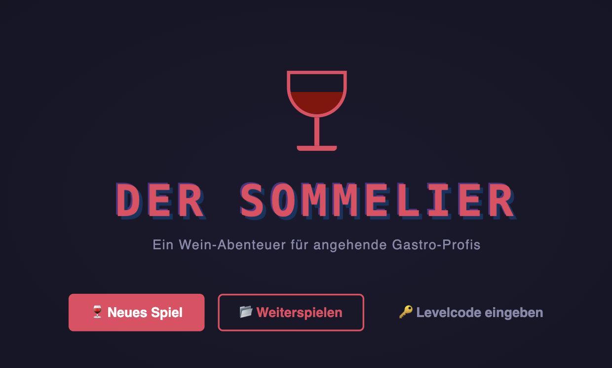
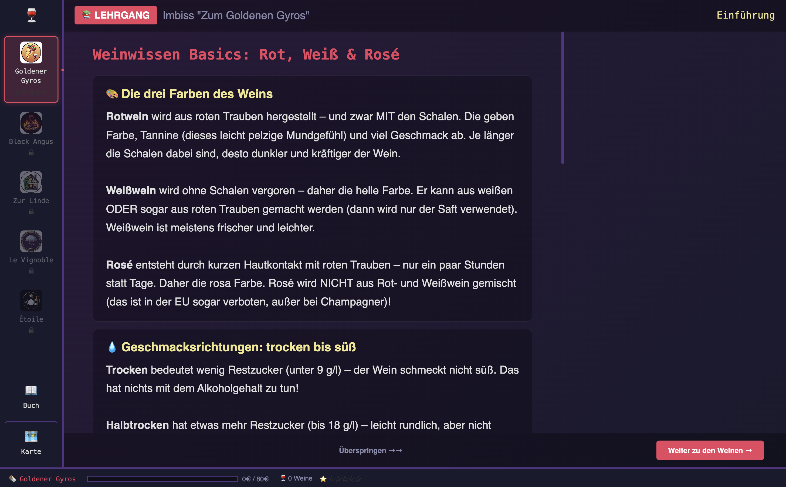
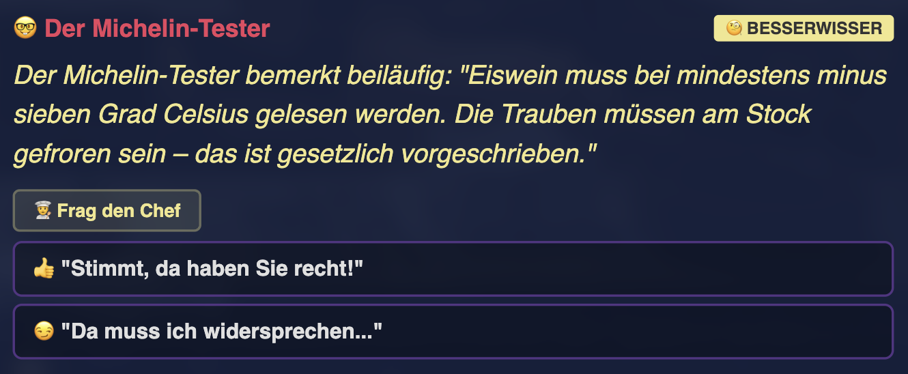
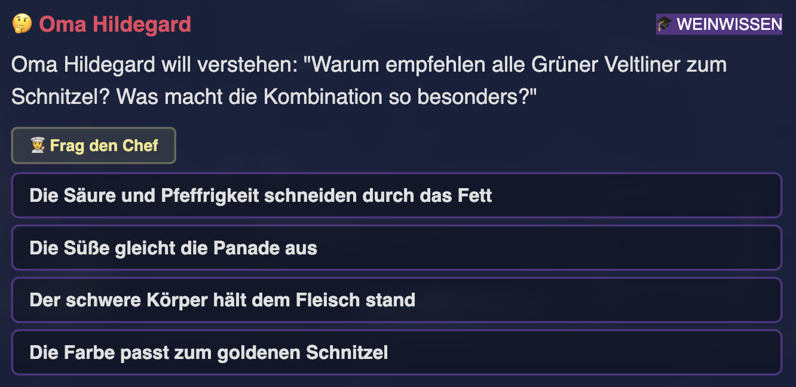
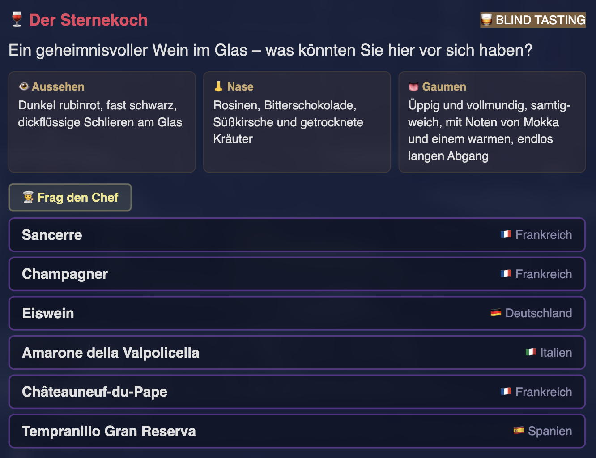
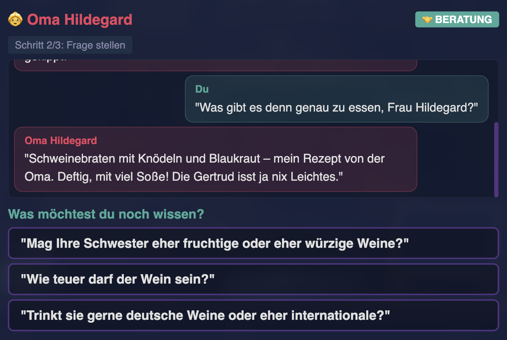

# Der Sommelier — Ein Wein-Abenteuer

> Browser-basiertes Wein-RPG: Arbeite dich vom Imbiss-Aushilfe zum Sterne-Sommelier hoch und lerne dabei alles über Wein.



## Spielkonzept

Du startest als Aushilfe im griechischen Imbiss "Zum Goldenen Gyros" und arbeitest dich durch fünf Restaurant-Stufen hoch — bis zum Michelin-Sterne-Restaurant "Étoile". Jede Stufe bringt neue Weine, anspruchsvollere Gäste und tieferes Weinwissen.

Weinwissen wird nicht durch trockene Theorie vermittelt, sondern durch Praxis: Du bedienst Gäste, empfiehlst Weine zu ihren Gerichten, entlarvst Besserwisser und bestehst Blindverkostungen. Jeder Gast hat eine eigene Persönlichkeit — von Oma Hildegard bis zum Michelin-Tester.

### Die fünf Restaurant-Stufen

| Level | Restaurant | Thema | Neue Regionen |
|-------|-----------|-------|---------------|
| 0 | Imbiss "Zum Goldenen Gyros" | Basics: Rot/Weiß/Rosé, trocken/süß | Deutschland, Italien, Griechenland |
| 1 | Steakhaus "Black Angus" | Körper & Tannine, Neue Welt | Frankreich, Österreich, Spanien |
| 2 | Gasthaus "Zur Linde" | Qualitätsstufen, regionale Tiefe | Elsass, Portugal |
| 3 | Restaurant "Le Vignoble" | Terroir & Weinbereitung, Crus | Burgund, Bordeaux, Piemont, Südafrika, Argentinien |
| 4 | Sterne-Restaurant "Étoile" | Verkostung & Weinsprache, Perfektion | Champagne, Rhône, Veneto |

## Screenshots

### Lehrgang — Weinwissen-Einführung pro Level


### Fragetypen

<table>
<tr>
<td width="50%">

**Besserwisser** — Stimmt die Behauptung?


</td>
<td width="50%">

**Weinwissen** — Quiz zu Weintheorie


</td>
</tr>
<tr>
<td>

**Blind Tasting** — Wein anhand von Beschreibung erkennen


</td>
<td>

**Beratung** — Mehrstufiges Beratungsgespräch mit dem Gast


</td>
</tr>
</table>

## Spielinhalte als PDF

Eine vollständige Übersicht aller Spielinhalte — Lehrgänge, Weine, Länder und Fragen je Level — gibt es als druckfertiges PDF:

**[der_sommelier_inhalte.pdf](der_sommelier_inhalte.pdf)** (13 Seiten, A4)

## Features

- **30 Weine** aus 9 Ländern — von Dornfelder bis Châteauneuf-du-Pape
- **228 Fragen** in 6 Fragetypen:
  - **Speiseempfehlung** — Welcher Wein passt zum Gericht?
  - **Gästewunsch** — Gast beschreibt vage, was er will
  - **Besserwisser** — Gast behauptet etwas — stimmt das?
  - **Weinwissen** — Theorie-Quiz rund um Wein
  - **Blind Tasting** — Wein anhand von Aussehen, Nase und Gaumen erkennen
  - **Beratung** — Mehrstufige Beratungsdialoge mit Rückfragen
- **50+ Gast-Sprites** mit eigener Persönlichkeit und Story
- **5 Küchenchefs** mit individuellem Charakter und Kommentaren
- **Wein-Explorer** mit interaktiver Weltkarte und Flaschen-Galerie
- **Lehrgang** pro Level — Theorie-Einführung vor der Schicht
- **"Frag den Chef"** — Hilfe-System, das falsche Antworten eliminiert (kostet Trinkgeld)
- **Trinkgeld-System** statt XP — verdiene Geld durch gute Empfehlungen
- **Favoritenweine** — Gäste haben Lieblingsweine für Bonus-Trinkgeld
- **Levelcodes** zum Freischalten einzelner Stufen
- **Speicherstand** via localStorage
- **Gastro-Humor**, Easter Eggs und Chef-Stress-Kommentare

## Tech-Stack

- **Vanilla HTML/CSS/JS** — keine Frameworks, keine Dependencies
- **Full HD Layout** (1920 × 1080) mit automatischer Skalierung auf jede Bildschirmgröße
- **DOM-basiertes Rendering** via innerHTML — kein Canvas
- **Pixel-Art Assets** generiert mit BFL/FLUX 2 Pro
- **Fonts:** "Press Start 2P" (Pixel) + "Inter" (UI) via Google Fonts

## Starten

```bash
# Repository klonen
git clone https://github.com/DEIN-USERNAME/der-sommelier.git
cd der-sommelier

# Lokalen Server starten (wegen Multi-File JS-Laden)
cd outputs/der-sommelier
python3 -m http.server 8000

# Browser öffnen
open http://localhost:8000
```

> Alternativ funktioniert jeder lokale HTTP-Server — z.B. `npx serve`, VS Code Live Server, etc.

## Projektstruktur

```
der-sommelier/
├── outputs/der-sommelier/
│   ├── index.html                # Shell — lädt CSS + JS
│   ├── css/style.css             # Full-HD-Layout
│   ├── js/
│   │   ├── data.js               # Wein-DB, Regionen, Gäste, Chefs
│   │   ├── questions_lv0.js      # Fragen Level 0 (Imbiss)
│   │   ├── questions_lv1.js      # Fragen Level 1 (Steakhaus)
│   │   ├── questions_lv2.js      # Fragen Level 2 (Gasthaus)
│   │   ├── questions_lv3.js      # Fragen Level 3 (Le Vignoble)
│   │   ├── questions_lv4.js      # Fragen Level 4 (Étoile)
│   │   ├── engine.js             # Game State, Spiellogik, Save/Load
│   │   └── scenes.js             # Alle Scene-Renderer
│   └── assets/
│       ├── chefs/                # 5 Küchenchef-Sprites
│       ├── guests/               # 50+ Gast-Sprites
│       ├── wines/                # 30+ Weinflaschen-Sprites
│       ├── restaurants/          # Restaurant-Logos
│       ├── imbiss/               # Hintergrund + Theke
│       ├── steakhaus/            # Hintergrund + Theke
│       ├── gutbuergerlich/       # Hintergrund + Theke
│       ├── gehoben/              # Hintergrund + Theke
│       ├── sterne/               # Hintergrund + Theke
│       └── map/                  # Weltkarten-Hintergrund
└── img/                          # Screenshots für README
```

## Levelcodes

Falls du direkt in ein bestimmtes Level springen möchtest:

| Level | Code |
|-------|------|
| 0 | *Startlevel* |
| 1 | `ANGUS` |
| 2 | `TERROIR` |
| 3 | `VIGNOBLE` |
| 4 | `SOMMELIER` |

Levelcode eingeben: Auf dem Titelbildschirm "Levelcode eingeben" klicken.

## Lizenz

**CC BY 4.0** — [Creative Commons Namensnennung 4.0 International](https://creativecommons.org/licenses/by/4.0/deed.de)

Du darfst das Werk:
- **Teilen** — in jedwedem Format oder Medium vervielfältigen und weiterverbreiten
- **Bearbeiten** — remixen, verändern und darauf aufbauen, auch kommerziell

Unter der Bedingung:
- **Namensnennung** — Du musst angemessene Urheber- und Rechteangaben machen

## Mitmachen

Pull Requests sind willkommen! Mögliche Beiträge:

- Neue Weine und Fragen ergänzen
- Übersetzungen (aktuell nur Deutsch)
- Neue Gast-Charaktere und Szenarien
- Sound & Musik
- Mobile-Optimierung
- Barrierefreiheit

---

*Prost!* 🍷
